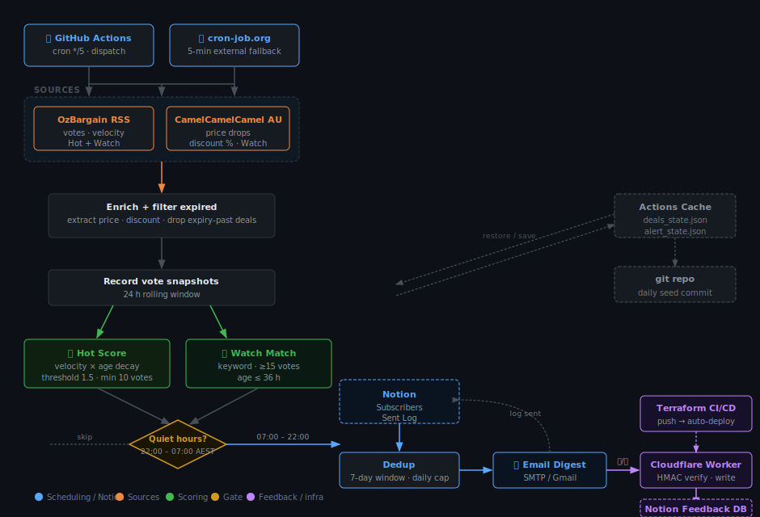

# Bargain Hunter

Runs every 5 minutes via GitHub Actions. Fetches deals from OzBargain and CamelCamelCamel AU, scores them for velocity (Hot) and matches against personal watch lists (Watch), then sends email digests to subscribers managed in Notion.

Full design: [`docs/PRD.md`](docs/PRD.md) · Implementation notes: [`docs/IMPLEMENTATION_PLAN.md`](docs/IMPLEMENTATION_PLAN.md)

## How it works



## Two tracks

- **Hot:** vote velocity + absolute votes + age decay → a single `score`. The score is
  bucketed into three levels (**good / great / top**); each subscriber picks the level they
  want and, optionally, the categories they care about. See [Hot scoring & levels](#hot-scoring--levels).
- **Watch:** keyword appears in a deal title → notifies the subscriber who listed that keyword. Noise guard: ≥5 votes (OzBargain) or ≥10% discount (CamelCamelCamel). Optional price ceiling to filter further.

A deal that qualifies on both tracks is merged into one notification.

## Hot scoring & levels

A deal's heat is a single weighted `score`. The highest tier it clears decides who gets
notified. All knobs live in `config/settings.yaml` under `scoring.hot`.

```
score = 0.5^(age_h / 12) × ( vote_vel/5  +  ln(1+votes)/ln(31)  +  0.1×comment_vel )  −  0.5×neg_ratio
        └── age decay ──┘   └ how fast ┘    └─ how many ─┘         └ discussion ┘        └ bad reviews ┘
```

| Term | Scale / weight | Intuition |
|---|---|---|
| `vote_vel / 5` | `5` = `min_votes_gain_per_window` (5 votes / 15 min = the baseline hot bar) | **Main signal** — how fast votes are climbing right now (votes/hour). |
| `ln(1+votes) / ln(31)` | `30` = `early_burst_min_votes` → this term = 1.0 at 30 votes | Accumulated approval, but **logarithmic** (diminishing) so a high vote count alone can't camp the top tier. |
| `0.1 × comment_vel` | `0.1` = `comment_velocity_weight` | Discussion buzz — a **small** top-up (was 0.25, dropped to 0.1 because comment-only deals were scoring as false positives). |
| `× age_factor` | `0.5 ^ (age / 12h)` — 12 h half-life | **Freshness**: heat is halved every 12 h. A new deal barely decays; a 24 h-old one is at ×0.25. |
| `− 0.5 × neg_ratio` | `0.5` = `neg_vote_penalty_weight`; `neg_ratio = neg/(pos+neg)` | Reputation penalty — caps at −0.5 when a deal is all downvotes. |

### The three levels

| Level | Floor (`min_score`) | Extra gate | Meaning |
|---|---|---|---|
| **good** | `1.5` | — | Mildly hot (the original hot floor). |
| **great** | `4.0` | — | Clearly hot — velocity is ~4× the baseline. |
| **top** | `7.0` | `min_votes ≥ 40` | Hottest of the hot. `universal_top: true` lets it reach **every** hot subscriber, bypassing their category filter. |

A subscriber set to `good` also receives `great` and `top`; set to `top` they only get the
very best. Roughly: **microscopically hot / very hot / once-a-day blockbuster**.

### Worked examples (real formula)

| Deal | Votes | Last 15 min | Age | Calculation | Score → level |
|---|---|---|---|---|---|
| Just-surfaced PS5 controller | 12 | +2 (8/h) | 0.5 h | `(8/5 + 0.75) × 0.97` | **2.28 → good** |
| Laptop spiking fast | 35 | +5 (20/h) | 0.5 h | `(20/5 + 1.04) × 0.97` | **4.90 → great** |
| Front-page GPU steal | 55 | +9 (36/h) | 1 h | `(36/5 + 1.17) × 0.94` | **7.90 → top** |
| Old deal still creeping | 60 | +2 (8/h) | 8 h | `(1.6 + 1.2) × 0.63` | **1.76 → good** (age decay nearly drops it) |
| Popular but contested | 45 (+10 down) | +3 (12/h) | 2 h | `(2.4 + 1.11) × 0.89 − 0.09` | **3.04 → good** (downvotes hold it back) |

### Tuning

Raise `min_votes_gain_per_window` or the tier `min_score` floors to fire less often; lower
them to fire more. Thresholds were calibrated on ~143 observed deals (`good` ≈ original hot
floor, ~57% of distinct hot deals reach `great`, ~36% reach `top`). Edit `settings.yaml` and
push — no code change needed.

## Sources

| Source | Type | Signal |
|---|---|---|
| OzBargain | Community deals | Vote velocity, comments |
| CamelCamelCamel AU | Amazon price drops | Discount % |

## Strategy guides

A separate daily pipeline (`strategy_hunter`) harvests money-saving *discussion* —
where people share combinations of techniques to buy things cheaply (e.g. "cheapest
way to get a MacBook in AU") — and turns it into structured guides for the website.

Three stages:

1. **Collect** (GitHub Actions, daily, fully automated): scrapes forum threads/posts,
   filters by relevance, and stores a corpus + an LLM-ready digest in the repo.
2. **Extract** (local, your own LLM): feed `data/strategies/digest/<date>.md` plus
   `src/strategy_hunter/prompts/extract_guide.md` to a model to produce structured
   guide JSON in `data/strategies/guides/`.
3. **Publish** (website): render guides at `/guides` in the `frontend/` Next.js app.

Sources (configurable in `config/settings.yaml` under `strategy:`):

| Source | What | How |
|---|---|---|
| OzBargain forums | "Find Me A Bargain" / "Financial" boards | HTML scrape of board + thread OP |
| OzBargain deal comments | busy deal threads (stacking tips) | HTML scrape of deal node comments |
| Reddit | r/AusFinance, r/AusFrugal, r/fiaustralia | OAuth API (preferred) or Atom RSS |
| Whirlpool | Shopping / Finance / Travel boards | HTML scrape of board + thread OP |

```bash
strategy-hunter collect          # fetch sources, store corpus, write digest, prune old
strategy-hunter digest           # rebuild the digest from the stored corpus
strategy-hunter validate-guides  # validate Stage 2 guide JSON against the schema
```

The corpus is pruned to `strategy.retention_days` (default 60) on every run, and a
maintainer alert is emailed if a collection run errors or harvests nothing
(`strategy.alert_on_failure`). Stage 3 renders guides at `/guides` in the
`frontend/` Next.js app (statically generated from `data/strategies/guides/*.json`).

### Reddit on CI (avoiding 429s)

Reddit rate-limits its **public** RSS feed hard from datacenter IPs (GitHub
Actions), so the source supports **app-only OAuth**, which works from CI:

1. Create a **script** app at <https://www.reddit.com/prefs/apps> (any name;
   `redirect uri` can be `http://localhost:8080`).
2. Add the two values as repo **Actions secrets**:
   `REDDIT_CLIENT_ID` (the id under the app name) and `REDDIT_CLIENT_SECRET`.

When set, `collect` logs `reddit: using OAuth app-only API`; when unset it falls
back to public RSS (logs `using public RSS …`) with patient retry/backoff, and
skips a subreddit gracefully if still rate-limited. Pacing is tunable under
`strategy.sources.reddit` in `config/settings.yaml`
(`request_delay_seconds`, `max_retries`, `max_backoff_seconds`).

Full design: [`docs/STRATEGY_PLAN.md`](docs/STRATEGY_PLAN.md).

## Watch keyword syntax

Keywords are stored in the Notion Subscribers database, one per line in the **Watch Keywords** field:

```
PHRASE [<=PRICE] [@HH:MM | @YYYY-MM-DDTHH:MM]
```

Examples:

| Keyword | Meaning |
|---|---|
| `iPhone 17 Pro` | Any iPhone 17 Pro deal (noise guard applies) |
| `Dyson <=499` | Dyson deal at or under $499 |
| `Sony WH <=300 @2026-07-01T23:59` | Sony WH under $300, expires 1 July 2026 |
| `BWS @19:00` | BWS deal, expires today at 19:00 AEST |

Bare `@HH:MM` means today in `Australia/Sydney`. Expired keywords are silently skipped. Price ceiling is optional — bare keywords match on votes/discount alone.

## Quick start (local dev)

```bash
python3 -m venv .venv && source .venv/bin/activate
pip install -e ".[dev]"
ruff check .
pytest
```

Dry-run (fetches real feed, prints what would be sent, no emails):

```bash
python -m bargain_hunter --dry-run
# or the installed script:
bargain-hunter --dry-run
```

## First-time Notion setup

1. Create a Notion integration at <https://www.notion.so/my-integrations> with
   **Insert content** + **Read content** + **Update content** permissions.
2. Share a Notion page with the integration. Copy the page ID from its URL (32 hex chars after the last `/`).
3. Run the setup script — it creates all databases and prints the IDs:

   ```bash
   export NOTION_TOKEN=ntn_xxx
   export NOTION_PARENT_PAGE_ID=<page-id>
   python scripts/setup_notion.py
   ```

4. Copy the printed IDs into `.env` (local) and GitHub Secrets (Actions).

## Adding subscribers

In Notion, open the **Bargain Hunter — Subscribers** database and create a new row:

| Field | Example |
|---|---|
| Name | Shawn Wang |
| Email | you@example.com |
| Active | ✓ |
| Channels | Email |
| Subscribe Hot Deals | ✓ |
| Watch Keywords | `BWS @19:00` |
| Max Alerts/Day | 10 |

## Configuration

Copy `.env.example` → `.env` and fill in credentials. `.env` is git-ignored.

Tunable thresholds (velocity window, hot score, vote gates, alerting cooldowns, etc.) are in `config/settings.yaml` — edit and push, no code change needed.

## GitHub Actions setup

### Secrets

Add these to Settings → Secrets and variables → Actions:

| Secret | Description |
|---|---|
| `NOTION_TOKEN` | Integration token (`ntn_...`) |
| `NOTION_SUBSCRIBERS_DB_ID` | From `setup_notion.py` output |
| `NOTION_SENT_LOG_DB_ID` | From `setup_notion.py` output |
| `SMTP_HOST` | e.g. `smtp.gmail.com` |
| `SMTP_PORT` | `587` |
| `SMTP_USERNAME` | Your Gmail address |
| `SMTP_PASSWORD` | Gmail app password (not your login password) |
| `EMAIL_FROM` | e.g. `Bargain Hunter Bot <you@gmail.com>` |
| `MAINTAINER_EMAIL` | Where to send failure alerts |
| `FEEDBACK_HMAC_SECRET` | Random hex string; signs 👍/👎 links to prevent spam writes |
| `R2_ACCESS_KEY_ID` | Cloudflare R2 S3 API access key (for Terraform state) |
| `R2_SECRET_ACCESS_KEY` | Cloudflare R2 S3 API secret |
| `CLOUDFLARE_API_TOKEN` | Cloudflare API token scoped to Workers Scripts: Edit |

### Variables

| Variable | Description |
|---|---|
| `FEEDBACK_BASE_URL` | Public URL of the deployed feedback worker |
| `CLOUDFLARE_ACCOUNT_ID` | 32-char Cloudflare account ID |
| `NOTION_FEEDBACK_DB_ID` | From `setup_notion.py` output |
| `TF_STATE_BUCKET` | R2 bucket name for Terraform state |
| `TF_STATE_R2_ENDPOINT` | `https://<account-id>.r2.cloudflarestorage.com` |

### Scheduling

GitHub Actions cron is unreliable for high-frequency schedules (`*/5`) on low-activity repos — runs can be delayed 30–60 minutes or skipped. The recommended setup is an external scheduler triggering `workflow_dispatch` precisely.

**Setup with [cron-job.org](https://cron-job.org) (free):**

1. Generate a GitHub Fine-grained PAT with **Actions: Read and write** permission scoped to this repo.
2. In cron-job.org, create a new job using "Import from cURL":

   ```bash
   curl -X POST 'https://api.github.com/repos/JadeSure/bargain-hunter/actions/workflows/hunt.yml/dispatches' \
     -H 'Authorization: Bearer <your-PAT>' \
     -H 'Accept: application/vnd.github+json' \
     -H 'Content-Type: application/json' \
     -d '{"ref":"main"}'
   ```

3. Set the schedule to every 5 minutes.

The built-in `*/5` cron in the workflow file remains as a fallback.

### First run

The first run is always a **cold start** — it records a baseline but sends nothing. From the second run onwards, hot deals and watch matches generate notifications.

## Feedback worker (Cloudflare Workers)

Each digest email includes per-deal 👍/👎 links. Clicks hit a Cloudflare Worker that writes to a Notion Feedback database for calibration. Links are HMAC-signed — unsigned requests are rejected (403).

The worker is deployed automatically via Terraform on every push to `main` that touches `terraform/**` or `feedback-worker/src/**`. State is stored in a Cloudflare R2 bucket.

To deploy manually:
```bash
cd terraform
terraform init -backend-config=backend.hcl
terraform apply
```

## Alerting

Maintainer alert emails are throttled: only sent after 3 consecutive failures, then at most once per hour while failures persist. A clean run resets the counter.

## Current status (v1.1 — 2026-06-24)

Live and running. Highlights since v1.0:

- **CamelCamelCamel AU** added as a second source (Amazon price drops via RSS)
- **Watch matching simplified** — votes-only noise guard; no longer requires a discount signal from the deal title
- **Maintainer alert throttling** — alerts fire only after ≥3 consecutive failures, then at most once per hour
- **HMAC-signed feedback links** — 👍/👎 links in emails are signed; unsigned or replayed requests are rejected (403)
- **Cloudflare Worker deployed** at `https://bargain-feedback.jadesure17.workers.dev` — collects feedback into a Notion Feedback database
- **Terraform CI/CD** — pushing to `main` auto-deploys the Worker and its secrets via `terraform-feedback.yml`

### TODO (v1.2 direction)

| Priority | Item |
|---|---|
| High | Threshold calibration — after 1–2 weeks of data, tune `hot_threshold`, `min_votes`, `early_burst_*` against labelled Sent Log |
| Medium | Feedback data loop — use 👍/👎 counts to validate which deal types subscribers actually act on |
| Medium | Monitor feedback worker for mail-scanner pre-clicks (Safe Links / Proofpoint may trigger links before users do) |
| Low | Telegram channel — interface already modelled; needs bot /start onboarding |
| Low | Scheduling reliability — AWS Lambda + EventBridge for sub-5-min latency (v2) |

## Privacy

- `data/deals_state.json` stores vote snapshots only (no personal data). It is committed once per day (AET midnight) as a calibration seed; hot-path state travels via GitHub Actions Cache between runs.
- Subscriber info, watch lists, and sent records live only in your private Notion workspace.
- Public repo logs never print subscriber identifiers — only aggregate counts.
- Feedback links are HMAC-signed; the worker never returns subscriber data.
